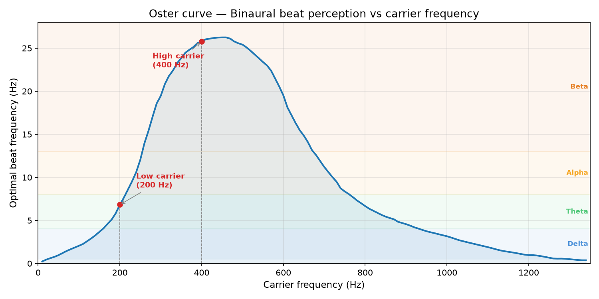

# Binaural Beats Mixer

Generate binaural beats and cross-frequency coupled (CFC) audio — stereo tones for brainwave entrainment. Requires only `numpy`.

## Quick start

```powershell
.venv\Scripts\Activate.ps1
pip install numpy
python binaural_beats.py -p alpha -d 600 -o alpha_10min.wav
```

## Warnings

- **Delta and theta** cause drowsiness. Never listen while driving, operating machinery, or doing tasks requiring alertness.
- **Alpha** — do not drive or operate machinery while listening.
- **High beta** (20+ Hz) can increase anxiety in sensitive individuals — start with short sessions, keep volume low.
- **Always use headphones** — binaural beats require isolation between ears. Speakers collapse the stereo field and the effect is lost.
- **Keep volume moderate** (≤ 0.5–0.6). Louder does not mean stronger entrainment.
- If you have epilepsy, consult a doctor before using rhythmic audio stimulation.

## Usage

```
python binaural_beats.py [-h] [-p PRESET] [-c CARRIER] [-b BEAT] [-d DURATION]
                         [-o OUTPUT] [-v VOLUME] [-f FADE]
                         [--f-hi F_HI] [--hi-mode {iso,binaural}]
                         [--mod-depth MOD_DEPTH] [--hi-carrier HI_CARRIER]
                         [--hi-mix HI_MIX] [--iso-depth ISO_DEPTH]
                         [--session-file SESSION_FILE] [--crossfade CROSSFADE]
```

### Options

| Option | Default | Description |
|--------|---------|-------------|
| `-p, --preset` | — | Preset name (overrides `--beat`/`--f-hi`) |
| `-c, --carrier` | 200 Hz | Center carrier frequency |
| `-b, --beat` | 10 Hz | Beat (difference) frequency |
| `-d, --duration` | 300 s | Output length |
| `-o, --output` | `binaural.wav` | Output filename (saved in `output/`) |
| `-v, --volume` | 0.2 | Amplitude (0–1) |
| `-f, --fade` | 0.5 s | Fade in/out length |
| `--f-hi` | — | High (nested) frequency for CFC mode (Hz) |
| `--hi-mode` | `binaural` | `iso` or `binaural` — high layer presentation |
| `--mod-depth` | 0.5 | Modulation depth 0–1 for CFC envelope |
| `--hi-carrier` | 400 Hz | Carrier frequency for the high layer |
| `--hi-mix` | 0.5 | High layer mix ratio 0–1 — lower = quieter high part |
| `--iso-depth` | 1.0 | Isochronic pulse depth 0–1 — 1 = fully mutes between pulses, 0 = no pulse |
| `--session-file` | — | JSON session file with segment definitions |
| `--crossfade` | 30 s | Sweep duration between segments in session mode |

### Examples

```powershell
# 10-minute theta meditation track
python binaural_beats.py -p theta -d 600 -o meditate.wav

# Theta-gamma CFC with two binaural beats (alert meditation)
python binaural_beats.py --f-hi 40 -p theta -d 600 -o theta_gamma.wav

# Same, but with isochronic high tone instead of binaural
python binaural_beats.py --f-hi 40 --hi-mode iso -p theta -d 600 -o theta_gamma_iso.wav

# Subtle coupling for sleep
python binaural_beats.py --f-hi 40 --mod-depth 0.3 -p delta -d 1800

# Using a combined CFC preset
python binaural_beats.py -p theta-gamma -d 600 -o monk_track.wav

# Multi-segment session from a JSON file
python binaural_beats.py --session-file sessions/meditation.json -o session.wav
```

## Session mode

Combine multiple segments into a single session file for progressive sessions —
e.g., start with alpha for focus, then theta-gamma for deep meditation, then
delta for rest. Segments transition via a smooth crossfade sweep.

### Session file format

A JSON array of segment objects. Only `duration` is required; all other fields
inherit from CLI defaults (no inter-segment inheritance).

```json
[
  {"beat": 10, "volume": 0.1,  "duration": 300, "desc": "alpha settle"},
  {"beat": 6,  "f_hi": 40, "hi_mode": "iso", "hi_mix": 0.5,
   "volume": 0.18, "duration": 600, "desc": "gamma-theta iso"},
  {"beat": 2,  "hi_mix": 0, "volume": 0.03,
    "duration": 300, "desc": "delta sleep"}
]
```

| Field | Falls back to | Description |
|-------|---------------|-------------|
| `duration` | (required) | Segment length in seconds |
| `beat` | `--beat` | Beat frequency (Hz) |
| `carrier` | `--carrier` | Carrier frequency (Hz) |
| `f_hi` | `--f-hi` | High frequency for CFC mode |
| `hi_mode` | `--hi-mode` | `"iso"` or `"binaural"` |
| `mod_depth` | `--mod-depth` | Modulation depth 0–1 |
| `hi_carrier` | `--hi-carrier` | High layer carrier (Hz) |
| `hi_mix` | `--hi-mix` | High layer mix ratio 0–1 |
| `volume` | `--volume` | Amplitude 0–1 |
| `iso_depth` | `--iso-depth` | Isochronic pulse depth 0–1 |
| `desc` | (informational) | Description label |

Each segment is fully explicit: all missing fields resolve to the CLI defaults,
not the previous segment. To disable the high layer on a segment, set
`"hi_mix": 0` — this silences the high carrier entirely regardless of `f_hi`
or `hi_mode`. Setting `"f_hi": null` only disables the pulse/beat in the high
layer, but the carrier tone still plays.

### Crossfade

During the `--crossfade` period at the start of each segment, numeric
parameters (beat, carrier, f_hi, hi_carrier, etc.) sweep linearly from the
previous segment's values to the new segment's values. Categorical parameters
(`hi_mode`) and snapped parameters (`volume`, `iso_depth`) stay constant
within each segment.

Transitions between CFC and non-CFC segments: `f_hi` sweeps to or from 0,
and the gain normalizer adjusts automatically (when `hi_mix` = 0 the CFC
formula collapses to simple binaural).

### Examples

```powershell
# 20-minute progressive session
python binaural_beats.py --session-file sessions/meditation.json -o progressive.wav

# Faster transitions
python binaural_beats.py --session-file session.json --crossfade 5 -o quick.wav
```

## Presets

### Simple presets

| Preset | Beat | Primary band | Sub-band(s) | Use case |
|--------|------|-------------|-------------|----------|
| `delta` | 2 Hz | Delta | Low Delta | Deep sleep, rest |
| `theta` | 6 Hz | Theta | Low–High Theta | Meditation, creativity |
| `alpha` | 10 Hz | Alpha | Low–High Alpha | Relaxed focus, calm |
| `beta` | 20 Hz | Beta | Mid–High Beta | Concentration, study |
| `gamma` | 40 Hz | Gamma | Low–High Gamma | Peak cognition, insight |

### CFC presets

| Preset | Beat + f_hi | Effect | Caution |
|--------|-------------|--------|---------|
| `theta-gamma` | 6 + 40 Hz | Lucid dreaming, hypnagogic awareness — theta dream-states with gamma self-awareness. The same coupling seen in REM sleep when frontal gamma spikes and the sleeper "wakes up" within the dream. | Best used right before sleep or during meditation. May induce sleep paralysis in the transition zone — start with short sessions. Not for driving. |
| `delta-gamma` | 2 + 40 Hz | Conscious deep rest — awareness persisting through delta-level regeneration. Memory consolidation, *yoga nidra*-like state. The body is in deep sleep but a thread of awareness remains. | Strictly for sleep or deep rest sessions. Start with `--mod-depth 0.3` — slow pulsing can be distracting at high depth. Not for driving. |
| `alpha-gamma` | 10 + 40 Hz | Flow state — alpha's relaxed spaciousness with gamma's cognitive binding. The 10 Hz rhythm is naturally pleasant, like a gentle shimmer. | Generally safe and comfortable. Best for creative work or light meditation. |
| `theta-beta` | 6 + 18 Hz | Attention regulation — theta's dreamy awareness coupled with beta's active focus. Balances inward reflection with outward alertness. | Not for sleep. Works well for reading, studying, or tasks that need sustained attention without hyper-focus. |

## CFC mode

Cross-Frequency Coupling (CFC) mimics how the brain coordinates oscillations
across different frequency bands — most commonly **phase-amplitude coupling
(PAC)**, where a slow rhythm's phase controls the amplitude of a faster rhythm.

When `--f-hi` is set, two layers are generated and summed:

1. **Low layer** — binaural beat at `beat` Hz on `carrier` Hz (L/R detuned).
   Entrains the slow rhythm.
2. **High layer** — tone at `hi_carrier` Hz, amplitude-modulated at `beat`
   Hz via `envelope = 1 + mod_depth × sin(2π × beat × t)`. The fast tone's
   volume pulses with the slow rhythm — this is the coupling.

High layer stereo presentation controlled by `--hi-mode`:

| Mode | What you get | Best for |
|------|-------------|----------|
| `binaural` | L/R detuned at `f_hi` Hz: `hi_carrier ± f_hi/2` | Second binaural beat at `f_hi` Hz (≤ 30 Hz) |
| `iso` | `hi_carrier` Hz tone pulsed at `f_hi` Hz, nested inside `beat`-Hz envelope | Gamma (40 Hz+) where Oster curve drops off |

In `iso` mode, the high layer is a carrier tone at `hi_carrier` Hz that pulses
`f_hi` times per second (isochronic tone). Pulse depth controlled by
`--iso-depth`:

```
gamma_pulse = (1 - iso_depth) + iso_depth × 0.5 × (1 + sin(2π × f_hi × t))
theta_env   = 1 + mod_depth × sin(2π × beat × t)
high_layer  = hi_gain × theta_env × gamma_pulse × sin(2π × hi_carrier × t)
```

At `--iso-depth 1.0` (default), `gamma_pulse` ranges 0–1, fully muting the
carrier between pulses for a classic isochronic feel. At `--iso-depth 0.7`,
it ranges 0.3–1 — gentler pulse, no silence gap. At `--iso-depth 0`, the
pulse is disabled and the carrier plays constantly.

The Oster curve at 400 Hz peaks around **~26 Hz (high beta)**. For `f_hi` at
gamma (40 Hz+), the binaural beat is past the curve's peak and harder to
perceive — use **`--hi-mode iso`** so the gamma pulsing is physically present
in the waveform, not reliant on the stereo illusion. For `f_hi` ≤ 30 Hz (beta
or lower), `binaural` mode works well.

Both layers are normalized so `--volume` means the same peak level regardless
of CFC settings.

### CFC cautions

- **Start with low mod_depth** (0.2–0.4). High depth can sound warbling or unsettling.
- **`--hi-mode iso` is recommended for gamma** (40 Hz+) — the binaural beat
  at 400 Hz + 40 Hz is hard for the brain to detect.
- **Keep carriers separated** — `--carrier` (200) and `--hi-carrier` (400)
  are an octave apart, which prevents frequency masking.
- **Low beat + high mod_depth** (e.g., delta at 2 Hz with depth 0.8+) can
  pulse slowly enough to be distracting rather than relaxing.

## How simple binaural works

Each ear receives a pure sine wave at slightly different frequencies:

- Left channel: `carrier - beat/2`
- Right channel: `carrier + beat/2`

The brain perceives the difference (`beat` Hz) as a rhythmic pulse — the
binaural beat. This works because the brain's superior olivary nucleus detects
the phase difference between the two ears. Use stereo headphones — speakers
mix the signals in the air and the effect is lost.

A raised-cosine (Hann) fade in/out prevents clicks at start and end.

All generated files go in `output/` (gitignored). Pass just a filename to `-o`,
the directory is automatic.

## Sub-bands reference

| Band | Sub-band | Range | Details | Caution |
|------|----------|-------|---------|---------|
| **Epsilon** | — | 0.1–0.5 Hz | Deepest sleep, unconsciousness, void-like state | Never while driving |
| **Delta** | Low Delta | 0.5–2.0 Hz | Physical regeneration, cellular clean-up, hormone release | Drowsiness — not for active tasks |
| | High Delta | 2.0–4.0 Hz | Transition to light sleep; present in brain injuries or severe learning fatigue | Drowsiness — not for active tasks |
| **Theta** | Low Theta | 4.0–5.5 Hz | Deep emotional processing, twilight dreaming, long-term memory access | Impaired focus |
| | High Theta | 5.5–8.0 Hz | Working memory, spatial navigation, creative flow states | Impaired focus |
| **Alpha** | Low Alpha | 8.0–10.0 Hz | Emotional calming, physical relaxation, internal idling | May cause drowsiness |
| | High Alpha | 10.0–12.0 Hz | Top-down selective attention, cognitive speed, peak performance | Caution when driving |
| **Beta** | Low Beta / SMR | 12.0–15.0 Hz | Relaxed focused attention, external processing without tension | Generally safe |
| | Mid Beta | 15.0–20.0 Hz | Active mental energy, analytic thinking, high alertness | May interfere with sleep |
| | High Beta | 20.0–30.0 Hz | Hyper-vigilance, stress rumination, fight-or-flight | Can trigger anxiety or panic |
| **Gamma** | Low Gamma | 30.0–45.0 Hz | Sensory binding — unified visual, auditory, tactile perception | Intense at high volume |
| | High Gamma | 45.0–100.0 Hz | Peak learning spikes, complex problem-solving, linguistic tasks | Intense at high volume |
| **Lambda** | — | ~200 Hz | Visual processing, saccade-related (not entrained) | Informational only |

## The Oster curve

[Gerald Oster's 1973 research](https://www.binauralbeatsmeditation.com/oster-curve/)
mapped how clearly binaural beats are perceived across different carrier
frequencies. The curve peaks around **440–460 Hz** (strongest perception)
and falls off below ~100 Hz and above ~800 Hz.

Our defaults sit deliberately on the curve:
- **200 Hz** low carrier — near the theta/alpha sweet spot
- **400 Hz** high carrier — near the high beta peak



Regenerate the plot with `python plot_oster.py` (requires `matplotlib`).

## Requirements

- Python 3.14+
- `numpy` (only dependency)
